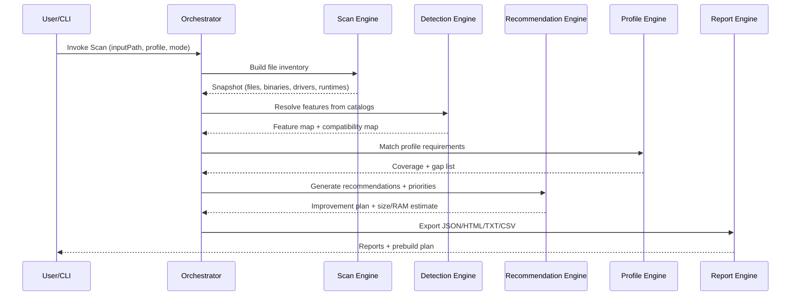
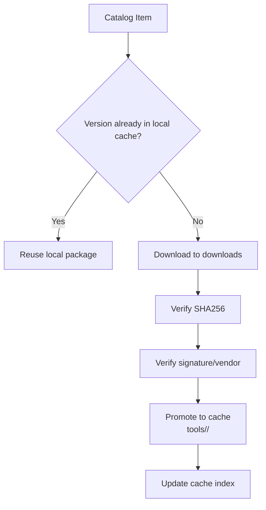
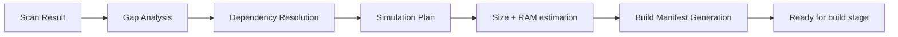

# Workflows Foundation

## 1) Workflow d analyse

## 2) Workflow cache offline

## 3) Workflow build preparation (no USB write)

## 4) Workflow historique de build
1. Generate build plan id
2. Persist profile, selected tools, selected drivers, architecture
3. Persist package hashes and source metadata
4. Persist expected output size and timestamp
5. Persist final image hash after build phase (future)
